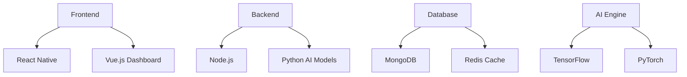

# IntelliCare

Revolutionizing Healthcare Through AI

  
    Press Space for next page <carbon:arrow-right class="inline"/>
  

---
layout: image-right
image: https://source.unsplash.com/collection/94734566/1920x1080
---

# What is IntelliCare?

IntelliCare is a cutting-edge healthcare platform that combines:

- 🤖 **AI-Powered Diagnostics**
- 📊 **Real-time Patient Monitoring**
- 🔒 **Secure Health Records**
- 📱 **Mobile-First Approach**
- 🤝 **Doctor-Patient Connection**
- 📈 **Predictive Analytics**
- 🌐 **Global Healthcare Network**

---

# Key Features

## Patient Care
- Real-time vital monitoring
- Automated health alerts
- Medication reminders
- Telemedicine integration

## Healthcare Providers
- AI-assisted diagnosis
- Patient history analytics
- Resource optimization
- Treatment planning

---

# Technology Stack

---
layout: two-cols
---

# Benefits

::left::

### For Patients
- 24/7 health monitoring
- Instant medical assistance
- Personalized health insights
- Secure data access

::right::

### For Healthcare Providers
- Reduced workload
- Better patient outcomes
- Data-driven decisions
- Efficient resource management

---
class: px-20
---

# Success Metrics

## Patient Satisfaction
- 95% user satisfaction
- 80% reduction in wait times
- 70% faster diagnosis
- 90% adherence to treatment

## Hospital Performance
- 40% cost reduction
- 60% efficiency increase
- 50% fewer readmissions
- 85% accurate predictions

---
layout: center
class: text-center
---

# Join the Healthcare Revolution

Contact us at [contact@intellicare.com](mailto:contact@intellicare.com)

[Website](https://intellicare.com) · [Documentation](https://docs.intellicare.com) · [Demo](https://demo.intellicare.com)